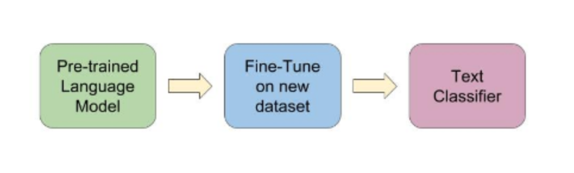
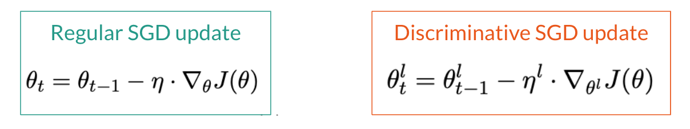

# Universal Language Model Fine-tuning for Text Classification

A brief overview of the paper that brought transfer learning to NLP by Howard and Ruder (2018). 

## Overview

**Context**: 

* At the time of publishing, transfer learning was a practice used in computer vision, but had not yet been *successfully* brought to NLP. 
* Most models with state-of-the-art performance on NLP tasks had to be trained from scratch, and existing language models required millions of documents to fine-tune on a different domain.

    An abbreviated history of NLP

In Howard and Ruder (2018),

* The authors proposed the **Universal Language Model Fine-tuning**, a three-step process to incorporate transfer learning into NLP. 
* This model was said to be *universal* because it provided a foundational language model that could be fine-tuned on any corpus for any text classification task (ex: sentiment analysis, topic classification, etc.)

The three steps are as follows:

1. **Pretrain a large language model**: Captures general features of language
   - Requires large, general corpus. Here, they use WikiText with 
   - The model used was AWD-LSTM (Average SGD Weight-Dropped Long Short-Term Memory). LSTM models had sequential processing and the Markov property; they pre-date transformers.
   - 1x cost
2. **Fine-tune language model**: Learns data-specific features
   - Requires texts from domain of interest
3. **Target task classifier fine-tuning**: Transfer learning to a target task
   - Fine-tune the model from step 2) on a classification task

Does this sound familiar? It should if you have background with transformers! This process in conceptually similar, and this paper was released only mere months before BERT. 

Further, the authors introduced two novel techniques to improve fine-tuning (steps 2 and 3 above):
* **Discriminative fine-tuning**: 
    - Different layers of the model capture different types of information, so these layers should be fine-tuned to different extents
    - Each layer is fine-tuned with different learning rates, where 𝜂L-1 = 𝜂L/26

* **Slanted Triangular Learning Rates**:
    - Test 

Critical Analysis:
* unidirectional
* tokenizer not mentioned in text, but they use word tokenizers
* great idea, but ULMFiT seems obsolete with the introduction and adoption of transformers. 

## Discussion 1
what's the difference between this and bert? hint: what tokenization are they using? 

## Discussion 2

## Discussion 3

## Resource Links

- Link to the paper, [Universal Language Model Fine-tuning for Text Classification](https://arxiv.org/abs/1801.06146)
- ULMFiT, [the Layman's introduction](https://nlp.fast.ai/classification/2018/05/15/introducing-ulmfit.html) 
- [BERT vs. ULMFiT]()
- [Example code from fast.ai]()
