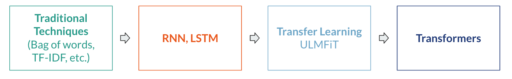

# Universal Language Model Fine-tuning for Text Classification

A brief overview of the paper that brought transfer learning to NLP by Howard and Ruder (2018). 

## Overview

**Context**: At the time of publishing, transfer learning was a practice used in computer vision, but had not yet been *successfully* brought to NLP. Most models with state-of-the-art performance on NLP tasks had to be trained from scratch, and existing language models required millions of documents to fine-tune on a different domain.

Howard and Ruder (2018) proposed the Universal Language Model Fine-tuning, a three-step process to incorporate transfer learning into NLP. This model was said to be *universal* because it provided a foundational language model that could be fine-tuned on any corpus for any text classification task (ex: sentiment analysis, topic classification, etc.)

The three steps are as follows:

* 

Further, they introduced two novel techniques to improve fine-tuning:
* Discriminative fine-tuning
* Slanted Triangular Learning Rates

Critical Analysis:
* 

## Discussion 1
what's the difference between this and bert? hint: what tokenization are they using? 

## Discussion 2

## Discussion 3

## Resource Links

- Link to the paper, [Universal Language Model Fine-tuning for Text Classification](https://arxiv.org/abs/1801.06146)
- ULMFiT, [the Layman's introduction](https://nlp.fast.ai/classification/2018/05/15/introducing-ulmfit.html) 
- [BERT vs. ULMFiT]()
- [Example code from fast.ai]()
