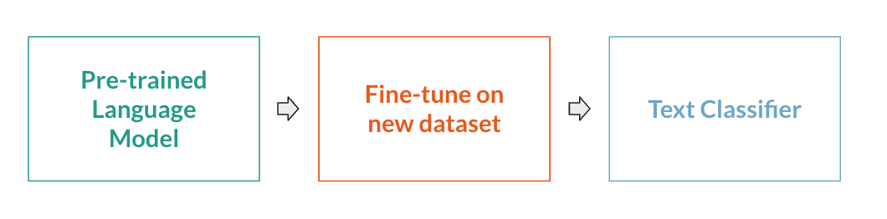

# Universal Language Model Fine-tuning for Text Classification

A brief overview of the paper by Howard and Ruder (2018) that brought transfer learning to NLP. 

## Overview

**Context**: 

* At the time of publishing, transfer learning was a practice used in computer vision, but had not yet been *successfully* brought to NLP. 
* Existing language models required millions of documents to fine-tune on a different domain and existing fine-tuning approaches only worked on the very last layer of these models.

    An abbreviated history of NLP

In Howard and Ruder (2018),

* The authors proposed the **Universal Language Model Fine-tuning**, a three-step framework to incorporate transfer learning into NLP. 
* This model was said to be *universal* because it provided a foundational language model that could be fine-tuned on any corpus for any text classification task (ex: sentiment analysis, topic classification, etc.)

The three steps are as follows:

1. **Pretrain a large language model**: Captures general features of language
   - Requires large, general corpus. Here, they use WikiText with 28k articles, 103M tokens
   - The model used was AWD-LSTM (Average SGD Weight-Dropped Long Short-Term Memory). Not a favored NLP model today, as LSTM models must be processed sequentially and struggle with long-range dependencies.
   - Word-based tokenization
   - 1x cost
2. **Fine-tune language model**: Learns data-specific features
   - Requires texts from domain of interest
   - Works with even "small" datasets
3. **Target task classifier fine-tuning**: Transfer learning to a target task
   - Fine-tune the model from step 2) on a classification task
   - Adds two linear blocks and a final RELU activation and softmax; only params in the model that are trained from scratch
   - *Gradual unfreezing*: Instead of fine-tuning all classification layers at once, they propose freezing all layers and gradually unfreezing starting from the layer with the least general knowledge (the last layer)

Results below suggest that this approach works far better than working from scratch, even when the dataset is very small (~100 observations).

Further, the authors introduced two novel techniques to improve fine-tuning (steps 2 and 3 above):
* **Discriminative fine-tuning**: 
    - Different layers of the model capture different types of information, so these layers should be fine-tuned to different extents
    - Each layer is fine-tuned with different learning rates, where 𝜂L-1 = 𝜂L/2.6

* **Slanted Triangular Learning Rates**:
    - The desired fine-tuning behavior is for the model to quickly converge to a desirable parameter space, and then spend the rest of the time refining
    - Suggested solution is to linearly increase the learning rate and then linearly decay it, resulting in the behavior graphed below: 

Critical Analysis:
* _What is overlooked?_ What empirical evidence is there for reducing the learning rate by a factor of 2.6 from layer n to layer n-1? Further, there is little speculation as to why they believe discriminative fine-tuning and slanted tirangular learning rates work well.
* _Have others disputed the findings?_ Not necessarily, but their approach to this setup (fine-tune language model, fine-tune on dataset, transfer knowledge to another classification task) is obsolete. LSTM not as efficient or accurate as transformers. 

## Discussion 1
How might a slanted triangular learning rate scheduler be useful in fine-tuning? (Note: we are just speculating because the authors did not provide their own intuition!)
* Recall: This scheduler starts the learning rate off very small, slowly increasing it until it reaches a max, and then decreases it even more slowly.
* *Helper Question: At the beginning of fine-tuning, we're introducing new vocabulary or re-defining existing vocab. Would this make error (cost) high or low? How does that affect training?)*

## Discussion 2
What are potential disadvantages with this method?
* Recall: This method uses LSTMS and word-based tokenization. What disadvantages come with these?

## Discussion 3
How could this framework be improved or updated with more current innovations? Is there a point considering how transformers have taken over NLP?
*Helper Question: how could we involve transformers?

## Resource Links

- Link to the paper, [Universal Language Model Fine-tuning for Text Classification](https://arxiv.org/abs/1801.06146)
- ULMFiT, [the Layman's introduction](https://nlp.fast.ai/classification/2018/05/15/introducing-ulmfit.html) 
- [Example tutorial+code from fast.ai](https://docs.fast.ai/tutorial.text.html)
- Why use ULMFiT over transformers? This github user has been [developing code, models, and data for ULMFiT](https://github.com/floleuerer/fastai_ulmfit) despite the models relative unpopularity
